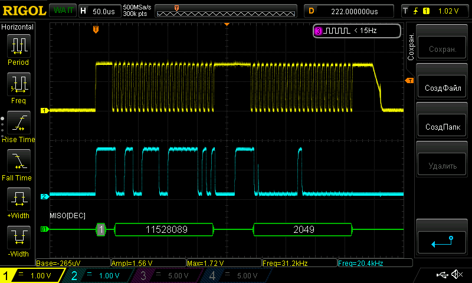
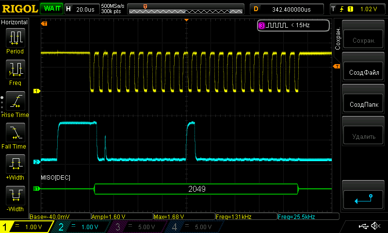
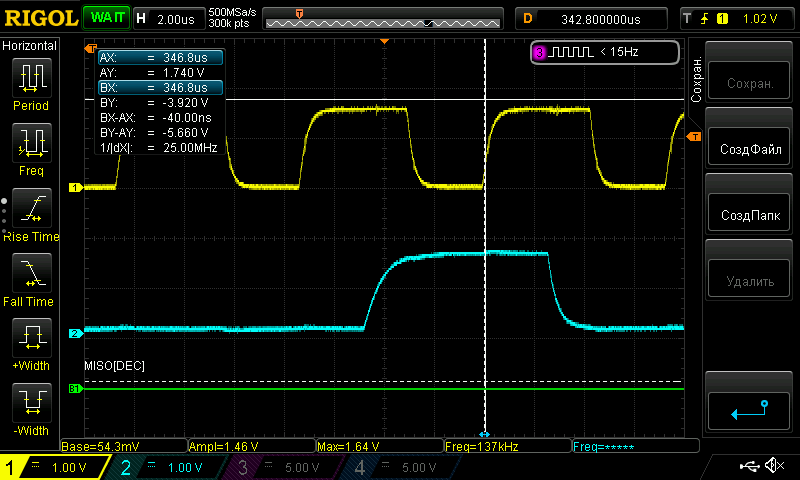
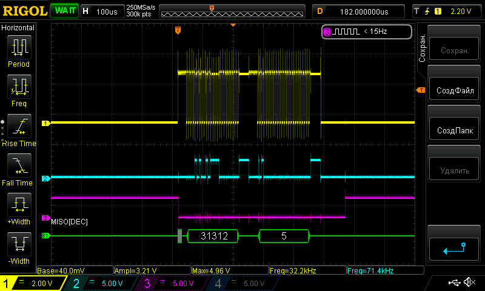

# Описание осцилограмм

Осцилограмма пакета данных от штангена.
Перед передачей линия тактирования (желтая) поднимается в высокий уровень (1.7В).
Время между пакетами данных - примерно 180ms, время передачи пакета - около 500us.
Передача состоит из двух чисел по 24 бита. Формат LSB.
Состояние передачи, при размере 0.1".

Крупно осцилограмма передачи одного из 24 бит.

Считывание по заднему возрастающему фронту.

Осцилограмма работы программы.

Логика работы: нога PA5 включается в режиме GPIO с внешним прерыванием,ожидается возрастающий фронт после паузы больше 100мс. Предполагается, что это начало пакета. В прерывании EXTI внешнее прерывание выключается, нога PA5 переводится в режим альтернативной функции SPI. SPI в режиме slave включается на прием. Также стартует TIM2 на 500us (примерное время передачи двух значений по 24 бита). Момент срабатывания таймера - нога PA6 (фиолетовая) на осцилограмме поднимается. Таймер в прерывании отключается, SPI отключается, прерывание по возрастающенму фронту на PA5 включается обратно.

Для согласования уровней штангена (1.7В) и STM32 (3.3В) использована микросхема [SN74LVC2T45DCTR](https://www.chipdip.ru/product/sn74lvc2t45dctr) запаянная на переходник [SOIC_SSOP_8](https://www.chipdip.ru/product0/9000419130)

STM32 подключена со стороны A ([datasheet](https://static.chipdip.ru/lib/974/DOC000974570.pdf)), нога DIR прижата к земле, передача от B к A.

Файлы .logicdata содержат записи лог. анализатора для разных значений. В пакете первое число абсолютная позиция, второе - относительная. Абсолютная позиция сбрасывается при выключении, поэтому не имеет никакого смысла. Относительная позиция - это то, что отображается на экране штангена. Судя по всему, на 1 дюйм выдает 20480 (0x5000) отсчетов.
